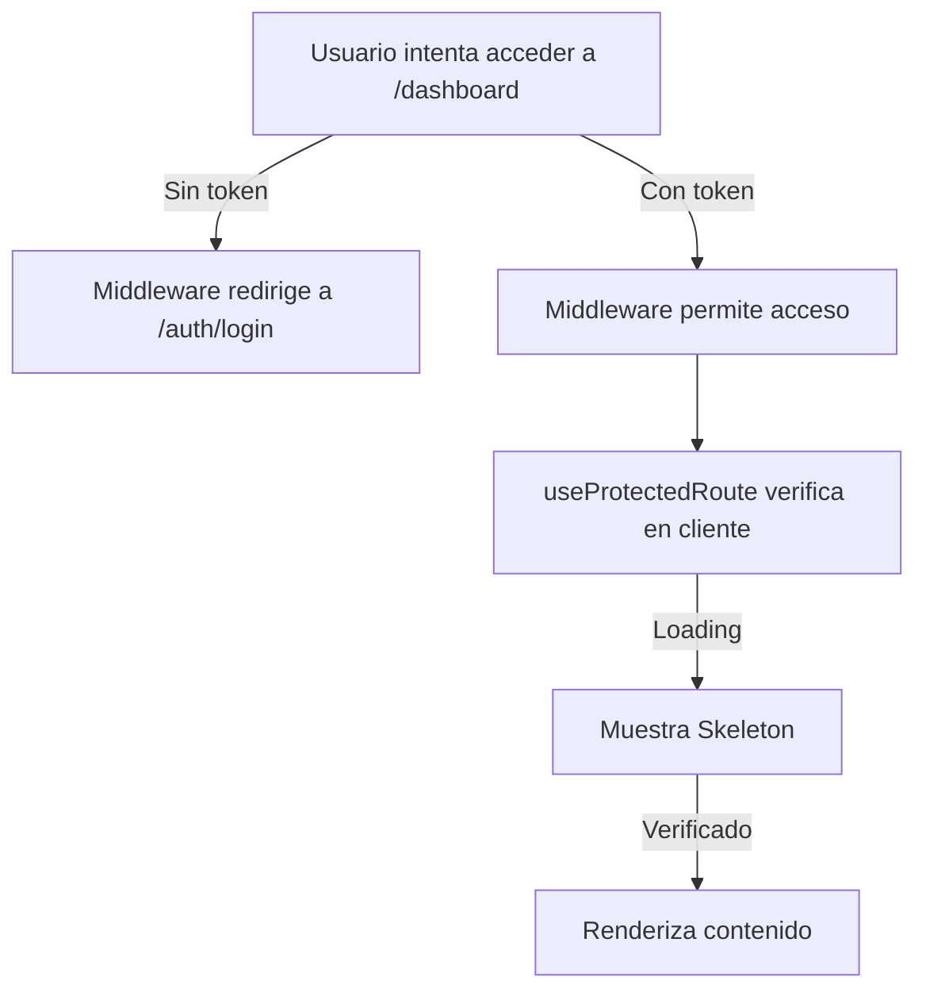

# 🔐 Protección de Rutas en Next.js

## Estrategia Implementada

Se ha implementado una **protección de 2 niveles**:

### 1️⃣ **Nivel Servidor: Middleware**
```typescript
// middleware.ts (raíz del proyecto)
```
- ✅ Se ejecuta ANTES de que la solicitud llegue al servidor
- ✅ Verifica tokens en cookies (más seguro)
- ✅ Redirige automáticamente si no hay autenticación
- ✅ Impide acceso directo a rutas protegidas

**Rutas Protegidas:** `/dashboard/*`  
**Rutas Públicas:** `/auth/login`, `/auth/register`, `/`

### 2️⃣ **Nivel Cliente: Hook + Context**
```typescript
// src/components/auth-provider.tsx
// src/hooks/useProtectedRoute.ts
```
- ✅ Verifica autenticación en componentes
- ✅ Protege contra acceso directo desde navegador
- ✅ Maneja estados de carga

---

## 📝 Cómo Usar

### Proteger una Página

```typescript
// src/app/dashboard/page.tsx
'use client';

import { useProtectedRoute } from '@/hooks/useProtectedRoute';
import { Skeleton } from '@/components/ui/skeleton';

export default function DashboardPage() {
  // Esto redirige a /auth/login si no está autenticado
  const { isLoading } = useProtectedRoute();

  if (isLoading) {
    return <Skeleton className="h-96 w-full" />;
  }

  return <div>Contenido protegido</div>;
}
```

### Proteger un Componente

```typescript
'use client';

import { useAuth } from '@/components/auth-provider';

export function ProtectedComponent() {
  const { isAuthenticated, isLoading } = useAuth();

  if (isLoading) return <div>Cargando...</div>;
  if (!isAuthenticated) return <div>No autorizado</div>;

  return <div>Contenido protegido</div>;
}
```

### Acceder a Info de Usuario

```typescript
'use client';

import { useAuthStore } from '@/modules/auth/store/authStore';

export function UserInfo() {
  const { user, logout } = useAuthStore();

  return (
    <div>
      <p>Bienvenido, {user?.email}</p>
      <button onClick={logout}>Cerrar sesión</button>
    </div>
  );
}
```

---

## 🔄 Flujo de Autenticación



---

## 🔐 Almacenamiento del Token

Se guarda en **2 lugares**:

1. **Cookies** 🍪
   - Accesible en middleware (servidor)
   - Incluida automáticamente en requests
   - Más seguro (HttpOnly si lo configuras en backend)

2. **localStorage** 💾
   - Accesible en cliente
   - Fallback en caso de que las cookies no funcionen
   - Sincronización entre tabs

---

## ⚙️ Configuración del Middleware

Archivo: `middleware.ts` (raíz del proyecto)

```typescript
// Rutas públicas (sin protección)
const publicRoutes = ['/auth/login', '/auth/register', '/'];

// Rutas protegidas (requieren token)
const protectedRoutes = ['/dashboard'];

// El matcher determina qué rutas ejecutan el middleware
// Por defecto: todas EXCEPTO api, _next/static, assets, etc.
```

---

## 🎯 Agregar Más Rutas Protegidas

### En el middleware:
```typescript
const protectedRoutes = [
  '/dashboard',
  '/admin',
  '/profile',
  '/settings',
];
```

### En la página:
```typescript
'use client';

import { useProtectedRoute } from '@/hooks/useProtectedRoute';

export default function AdminPage() {
  useProtectedRoute(); // Proteger esta página
  
  return <div>Admin Panel</div>;
}
```

---

## 🚀 Ejemplo Completo: Página Protegida

```typescript
// src/app/profile/page.tsx
'use client';

import { useRouter } from 'next/navigation';
import { useAuthStore } from '@/modules/auth/store/authStore';
import { useProtectedRoute } from '@/hooks/useProtectedRoute';
import { Button } from '@/components/ui/button';
import { useToast } from '@/hooks/useToast';

export default function ProfilePage() {
  const router = useRouter();
  const { user, logout } = useAuthStore();
  const { success } = useToast();
  const { isLoading } = useProtectedRoute();

  const handleLogout = () => {
    logout();
    success('Sesión cerrada');
    router.push('/auth/login');
  };

  if (isLoading) return <div>Cargando...</div>;

  return (
    <div className="max-w-2xl mx-auto p-6">
      <h1 className="text-2xl font-bold mb-4">Mi Perfil</h1>
      
      <div className="bg-card p-4 rounded-lg mb-6">
        <p className="text-lg">Email: {user?.email}</p>
        <p className="text-lg">Nombre: {user?.name}</p>
      </div>

      <Button onClick={handleLogout} variant="destructive">
        Cerrar Sesión
      </Button>
    </div>
  );
}
```

---

## ✅ Checklist de Seguridad

- [x] Token guardado en cookies (servidor)
- [x] Middleware verifica en servidor
- [x] Hook verifica en cliente
- [x] Redirección automática a login
- [x] Protección contra acceso directo
- [x] Estado de carga mientras verifica
- [x] AuthProvider en layout.tsx
- [x] Soporte para SSR

---

## 🔗 Archivos Relacionados

- [middleware.ts](middleware.ts) - Protección en servidor
- [src/components/auth-provider.tsx](src/components/auth-provider.tsx) - Context de auth
- [src/hooks/useProtectedRoute.ts](src/hooks/useProtectedRoute.ts) - Hook para páginas
- [src/modules/auth/store/authStore.ts](src/modules/auth/store/authStore.ts) - Estado global
